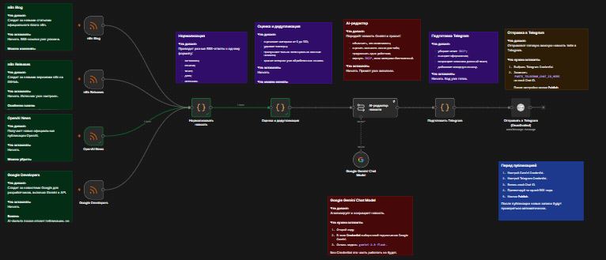

# Automation Radar

Учебный workflow на n8n, который собирает новости об автоматизации и AI из нескольких источников, отбирает полезные материалы и готовит короткие сообщения для Telegram.

## Что делает

- получает новости из RSS-лент n8n Blog, n8n Releases, OpenAI News и Google Developers;
- очищает HTML и приводит данные к единому виду;
- оценивает важность новости по ключевым словам и свежести;
- не пропускает дубликаты с помощью сохранённого состояния workflow;
- передаёт отобранные новости в Gemini для краткого русскоязычного резюме;
- формирует сообщение для Telegram.

## Стек

n8n, RSS, JavaScript, Google Gemini, Telegram Bot API.

## Схема

`RSS-источники → нормализация → оценка и дедупликация → Gemini → подготовка сообщения → Telegram`

## Что я отработал

Работу с RSS, JavaScript-узлами n8n, обработку текста, фильтрацию, дедупликацию, LLM и интеграцию с Telegram.

> Это учебный проект. Данные Telegram и подключения к сервисам не публикуются.
>
> 
